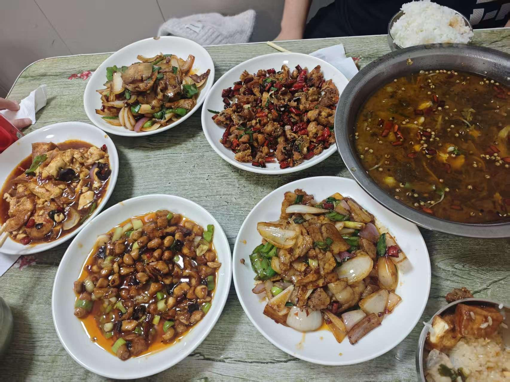

（本报讯）传奇人物的遇见总是有伏笔的。当思想界的先驱者，遇上在技术与美食领域均有深厚造诣的实践大家，两者的会晤将碰撞出怎样的火花？近日，一场别开生面的跨界交流在**永庆村小区旁的"川味排档"**诚挚展开。这里没有正式的会议桌，却有着升腾的镬气与家常的喧闹。正是这充满人间烟火的氛围，催化了一场深刻的思维交融，并正式宣告了一个全新的跨界联盟——**"SNP 组织"**的诞生。

## 从一台电脑到一桌川菜

本次会晤的故事，要从一次拿电脑开始说起，而其进程则深深烙印在一桌地道川菜之中。

思想上的交锋与筷子间的往来同步进行：

- 酸菜鱼的鲜辣
- 回锅肉的馥郁（席间更是续加一盆）
- 麻辣鸡丁的激昂
- 宫保鸡丁的甜酸
- 家常豆腐的温润

构成了讨论的最佳背景音。

## SNP 名称的由来

正是在这酣畅的席间，双方确立了组织的名称 **"SNP"**——它最初灵感源于接地气的谐音：

> （S）HI、（N）IAO、（P）I

而在会晤中被共同赋予更高层次的全新内涵：

| 字母 | 含义 | 说明 |
|------|------|------|
| **S** | Synergy | 协同 |
| **N** | Nourishment | 滋养（既指物质美食，亦指精神食粮） |
| **P** | Pioneering | 开拓 |

这一从市井到哲思的升华，恰好见证了本次会晤融合无界的特质。

## 席间佳话

席间细节亦成佳话：

- **技术与美食大家**尽显本色，虽自谦"今日状态略有不佳"，仍从容品鉴**六碗米饭**以佐佳肴
- **思想先驱**则更重品咂交谈，**一碗半米饭**间，思想火花不断迸发

双方从技术逻辑到美食哲学，再到社会人文的前瞻思考，发现迥异领域间存在着共通的方法论与创新内核。思想的宏观洞察为实践提供了意义锚点，而技术美食的微观经验则为抽象思维提供了坚实注脚。

## SNP 组织正式成立

基于对促进系统性创新、融合多元智慧的共同愿景，双方在这间烟火气十足的排档里，共同决议正式成立 **"SNP 组织"**。

该组织旨在建立一个汇聚**思想家、科技先锋、美食艺术家**等多领域创新者的高端跨界平台，致力于：

- 推动跨界研讨
- 发起创新项目
- 探索将思维成果与技术手段转化为滋养社会的具体方案

---

> 高远的思想未必诞生于庙堂，它同样可以萌发于嘈杂的市井排档，在一碟回锅肉、一碗米饭的陪伴下生根发芽。

SNP 组织的成立，标志着这场始于一次"电脑传递"、成于一桌"川味家常"的跨界火花，将走向持续发光发热的系统性努力。业界期待，这一充满反差与生活温度的联盟，将为未来带来更多贴近大地、又仰望星空的创新与变革。
